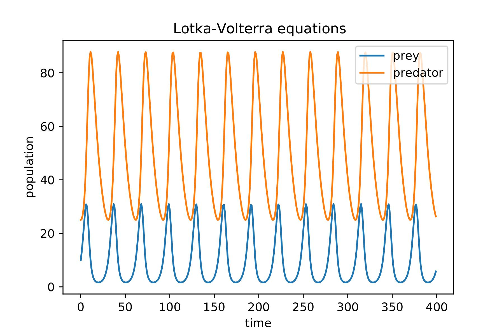
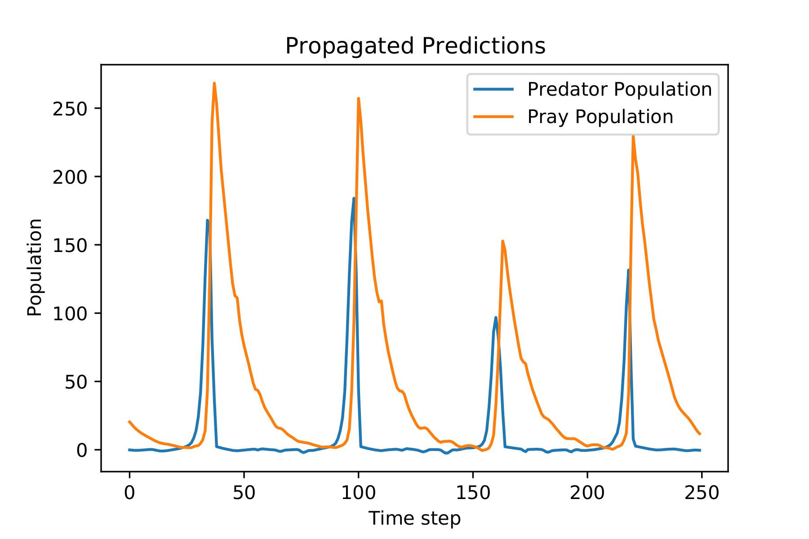

# 02.01.Deploying_Forecasting_Model_on_Azure

This experiment trains an LSTM for forecasting the two dimensional Lotka-Volterra System. 
The predictions are then propagated *n* steps into the future.

The model is finally deployed on MS Azure using the Azure ML Software Development Toolkit.

*02.01 Lotka Volterra System*

The Lotka Volterra equations are a system of two differential equations that describe the dynamics of a predator and a pray population.

Where *x* represents the total number of preys, *y* the number of predators and $\alpha,\beta,\delta, \gamma$ are parameters describing the interaction of the two populations.

The equations are integrated over 400 time steps and the results are ploted below:

The trained LSTM is used to predict the two dimensions one step into the future. The predictions are then used to propagate the systems 250 steps into the future.
The results are shown below:

